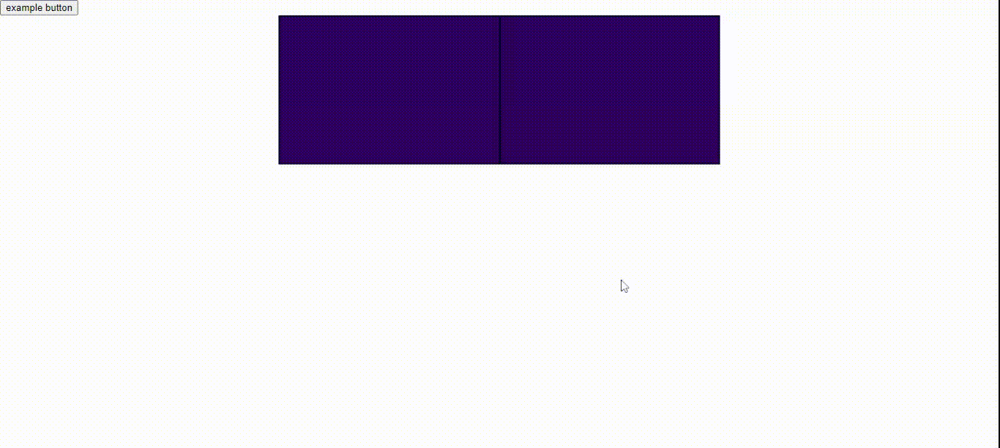

# Roulette Project
A similar roulette to other case opening sites. Not that much similar but i'm trying to make it looks better.
## Table of contents
* [Setup](#setup)
* [Options](#options)
* [Example](#example)
* [Preview](#preview)
* [Version](#version)
* [To-do](#to-do)
* [Features](#features)
## Setup
Paste this in head section:
```html
<script src="https://raw.githubusercontent.com/yinee-c/roulette/main/roulette.js"></script>
```
and this at the end of body section:
```html
    <script>
        var rol = new Roulette({});
        // Define here your own event listener and then add rol.start();
        document.getElementById('example').addEventListener('click', function() {
            rol.start();
        });
    </script>
```
last one in body, where you want:
```html
    <div id="container">
        <div id="wrap"></div>
        <div id="line"></div>
    </div>
    <div id="winContainer"></div>
```

That's all what you need to do!
## Options
| Option | Description | Type |
| ------ | ------ | ------ |
| timer | The time, in milliseconds (thousandths of a second) | Number |
| maxChance | Max random chance number for items | Number |
| containerId | Id name for element | String |
| slideContainerId | Id name for element | String |
| slideClassName | Class name for element  | String |
| lineId | Id name for element | String |
| itemsRender | Items to renderer | Number |
| items | Your items | Object |
| outputWin | After roll is done output a win item | Boolean |
| outputWinId | Id name for element | String |
## Example
Template is in this repository, just open index.html! Oh.. There's also a template of CSS! :)
## Preview
A gif preview!

## Version
Currently 1.1;
## To-do
* Cache DOM elements in js.
* More animations
* Better css.
* and more..
## Features
* Customizable options
* Random items
* Max chance
* Animation of rolling to the left
* and more.. i'll write here more later
